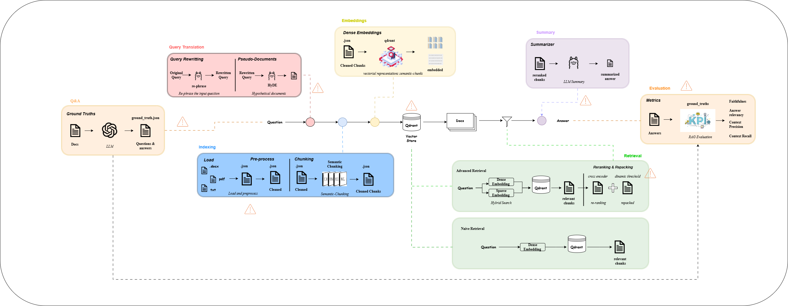

# INF3822 : Proyecto Aplicado I (RAG)

---

## 01.- Objetivo

---

Cada grupo analizará la regulación de un país asignado al azar y creará una aplicación interactiva en Streamlit. En la aplicación, se integrarán técnicas de procesamiento de datos, chunking, creación de embeddings y, opcionalmente, un sistema de recuperación usando Qdrant para indexar la información.

Fuentes de Información:
* Argentina
* Brasil
* Chile
* Mexico
* Estados Unidos*
* Reino Unido

---

## 02.- Instrucciones

### 01. - Asignación del País y Carga de Datos:

* A cada grupo se le asignará un país al azar. 
* Obtengan la regulación correspondiente al país asignado, en formato PDF o directamente desde el sitio web oficial.
* Asegúrense de guardar el archivo de texto procesado o descargado en una carpeta llamada data dentro del repositorio.

### 02. Limpieza de Datos:
* Apliquen las técnicas de limpieza vistas en clase para preparar el texto. Esto incluye:
  * Eliminación de caracteres especiales.
  * Normalización de texto (conversión a minúsculas, eliminación de acentos, etc.).
  * Eliminación de palabras irrelevantes (stop words) o la lematización del texto.
  * Incluyan este proceso en un script Python dentro de la carpeta src, asegurándose de que el código sea reproducible para otros grupos.

### 03. Segmentación (Chunking):
* Dividan el texto en fragmentos (chunks) aplicando alguna de las técnicas estudiadas (token-level, sentence-level o semantic-level).
* Asegúrense de que los fragmentos mantengan un balance entre contexto y precisión para facilitar el proceso de recuperación.
* Guardar los datos segmentados dentro de la carpeta data/chunks. 
* Incluyan este proceso en un script Python dentro de la carpeta src, asegurándose de que el código sea reproducible para otros grupos.
* BONUS: Incluyan algún preprocesamiento adicional que pueda mejorar la calidad del análisis, como 

### 04. Creación de Embeddings:
* Generen embeddings para cada chunk utilizando un modelo de embeddings que elijan.
* Guarden los embeddings en la carpeta embeddings dentro del repositorio para usarlos en el paso de recuperación.

### 05. BONUS - Creación de un Retriever e Indexación con Qdrant:
* Utilicen Qdrant para indexar los embeddings y configuren un sistema de recuperación que permita realizar consultas sobre la regulación específica del país.
* Implementen una funcionalidad que permita realizar búsquedas dentro de los chunks indexados en Qdrant desde la aplicación de Streamlit.
* Este paso es opcional y otorgará puntos adicionales.

### 06. Creación de la Aplicación en Streamlit:
* En la carpeta raíz del repositorio, incluyan un archivo app.py donde desarrollarán la aplicación de Streamlit.
* La aplicación debe permitir:
  * Cargar los datos.
  * Mostrar el resultado de la limpieza y chunking.
  * Realizar consultas sobre los embeddings de los chunks de texto.
  * (BONUS) Realizar consultas en tiempo real sobre los datos indexados en Qdrant.
* El código debe ser modular, y el flujo debe estar bien documentado.

### 07. Documentación y Entrega:
* Asegúrense de que el repositorio incluya un archivo README.md con:
  * Descripción del proyecto.
  * Instrucciones detalladas para ejecutar la aplicación.
  * Dependencias y pasos para la configuración del entorno.

### 08. Evaluación
El repositorio de cada grupo será evaluado en base a los siguientes criterios:
* Funcionalidad Completa: La aplicación en Streamlit debe ser interactiva y permitir la visualización y consulta de los datos.
* Implementación Correcta de Procesamiento de Datos y Chunking.
* Creación y Uso de Embeddings.
* BONUS: Implementación de un sistema de recuperación e indexación usando Qdrant.
* Documentación y Claridad: La estructura del código, la documentación en README.md, y el archivo requirements.txt deben permitir la ejecución del proyecto sin problemas.

---

# Proyecto de Recuperación Aumentada con Generación (RAG)

**Grupo 5**:
* Rolando Labrín
* Vicente Rojas
* Yovany Quispe

El proyecto para el curso INF3822 Proyecto Aplicado I implementa un Retrieval Augmented Generation (RAG) utilizando **Streamlit** como interfaz (UA) y **Qdrant** como base de datos de vectores. El sistema permite realizar búsquedas semánticas en documentos de regulaciones internacionales **previamente cargados y procesados**.

* Para este caso se procesan los datos de regulaciones internacionales de EEUU.

---

## Pipeline RAG


---


## Características del Proyecto

- Generación y almacenamiento de embeddings para los documentos procesados.
- Búsquedas semánticas eficientes mediante la base de datos vectorial **Qdrant**.
- Interfaz amigable desarrollada en **Streamlit** para la interacción del usuario.

---

## Requisitos Previos

Antes de comenzar, se debe asegurar de tener previamente instalado lo siguiente:

1. **Python** (>=3.8)
2. Las dependencias necesarias que se pueden instalar desde el archivo `requirements.txt`.

```bash
pip install -r requirements.txt
```

3. **Qdrant** (Qdrant Cloud o un servidor local).

---

## Estructura del Proyecto

```plaintext
├── chunking/                # Módulo para dividir los documentos en chunks semánticos
├── embedding/               # Módulo para generar embeddings densos
├── evaluacion/              # Módulo para evaluar el sistema RAG
├── loaders/                 # Módulo para la carga y preprocesamiento de documentos
├── Query_Rewriting/         # Módulo para la reformulacion de la consulta del usuario
├── reranker/                # Módulo para aplicar técnica de reranking de los chunks recuperados
├── retrievers/              # Módulo para realizar el retriever de los chunks del VS
├── summarizer/              # Módulo para la generacion de un resumen de la busqueda
├── vector_store_client/     # Cliente para interactuar con la base de datos Qdrant
├── main.py                  # Script principal para la configuración inicial
├── main_app.py              # Aplicación Streamlit
├── requirements.txt         # Dependencias del proyecto
└── README.md                # Documentación del proyecto
```

---

## Guía de Uso

### 1. Primera Ejecución

1. Corre el archivo `main.py` la seccion de la "Etapa 1" para:
   - Procesar los documentos en formato PDF/doc/txt.
   - Generar embeddings de los chunks semánticos utilizando `sentence-transformers`.
   - Crear y generar la base de datos vectorial en Qdrant.
- 

   Comando para ejecutar:

   ```bash
   python main.py
   ```

1. Una vez finalizado, el sistema habrá preparado todo lo necesario para la búsqueda semántica.
2. Se puede ejecutar el retriever con las funciones avanzadas si se descomenta la "Etapa 2" del codigo.
3. Actualizar con consultas diferentes/actualizadas/adicionales el archivo ground_thruths.json

---

### 2. Uso de la Aplicación Streamlit

La aplicación Streamlit permite realizar consultas y obtener resultados de búsqueda de forma interactiva.

1. Ejecuta el archivo `main_app.py`:

   ```bash
   streamlit run main_app.py
   ```

2. Se genera de forma previa el archivo ground_thuths.json con las consultas y respuestas esperadas.
   1. Por temas de tiempo no se alcanzo a integrar esta etapa de generacion de consultas y groundthruths dentro del codigo. 

3. Introduce una consulta en la barra de búsqueda de las almacenadas en ground_thruths.

4. Se muestra en pantalla y almacena el resultado de la comparacion de la busqueda simple y avanzada del RAG.

---

## Configuración y Personalización

### Configuración de Modelos y Base de Datos

El archivo `main_app.py` permite modificar los siguientes parámetros:

- Modelo utilizado para embeddings: `sentence-transformers/all-mpnet-base-v2`.
- Nombre de la colección en Qdrant: `semantic_chunks`.
- Distancia métrica: `COSINE`.
- LLM: Ollama - llama3.2

* OBS: Los parametros antes mencionados son los que se utilizaron

---

## Dependencias Clave

- **Streamlit**: Para la interfaz de usuario.
- **Qdrant**: Base de datos vectorial para almacenamiento y recuperación de embeddings.
- **Sentence-Transformers**: Para generar embeddings semánticos de alta calidad.

---

## Grupo 5

Rolando Labrín
Vicente Rojas
Yovany Quispe

---


